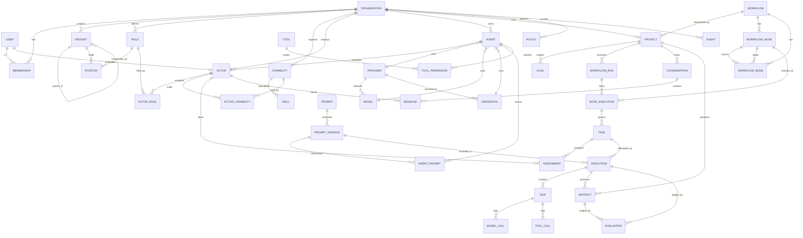

# Database

This document describes the persistence layer: the core tables, an ERD,
key indexes, and the deliberate policy on relational vs. JSON fields. It
is the physical counterpart to [DOMAIN_MODEL.md](DOMAIN_MODEL.md).

## 1. Engines

| Environment        | Engine      | Rationale                                  |
| ------------------ | ----------- | ------------------------------------------ |
| Docker dev / prod  | PostgreSQL  | JSONB, real indexes, concurrency, `SERIAL`/identity for the monotonic Event id |
| Local dev / tests  | SQLite      | Zero-setup, fast test runs; migrations target both |

All models use UUID primary keys **except** `Event`, whose primary key is
a monotonically increasing integer (BIGSERIAL / AUTOINCREMENT) so the SSE
tail can use a simple `WHERE id > cursor` scan. Timestamps are stored in
UTC.

## 2. ERD (core tables)



If Mermaid is unavailable, the same shape in ASCII:

```text
ORGANIZATION ─┬─ MEMBERSHIP ─ USER
              ├─ ORGUNIT (self-tree) ─ POSITION ─ ROLE
              ├─ CAPABILITY ─ SKILL
              ├─ ACTOR ─┬─ (USER?)  (AGENT?)
              │         ├─ ACTOR_ROLE ─ ROLE
              │         └─ ACTOR_CAPABILITY ─ CAPABILITY
              ├─ AGENT ─┬─ PROVIDER ─ MODEL / CREDENTIAL
              │         ├─ AGENT_PROMPT ─ PROMPT_VERSION ─ PROMPT
              │         └─ TOOL_PERMISSION ─ TOOL
              ├─ PROJECT ─┬─ WORKFLOW ─ WORKFLOW_NODE / WORKFLOW_EDGE
              │           ├─ GOAL
              │           └─ WORKFLOW_RUN ─ NODE_EXECUTION ─ TASK
              │                   ─ ASSIGNMENT ─ ACTOR
              │                   ─ EXECUTION ─ RUN ─ MODEL_CALL / TOOL_CALL
              ├─ CONVERSATION ─ MESSAGE ─ ACTOR
              ├─ ARTIFACT ─ EVALUATION
              ├─ POLICY
              └─ EVENT (append-only)
```

## 3. Relational vs. JSON — the policy

**Rule: relational by default; JSON only where extensibility is genuinely
required.** JSON is reserved for shapes that (a) vary per row by design,
(b) are not queried in `WHERE`/`JOIN` hot paths, and (c) would otherwise
force premature schema churn. Anything with a fixed shape or a query need
is a real column with a real index.

| Table            | JSON fields                              | Why JSON is justified |
| ---------------- | ---------------------------------------- | --------------------- |
| `workflow_node`  | `configuration`, `inputs`, `outputs`, `position`, `metadata` | Node config is *per node type* — a Condition node and an AgentTask node have entirely different shapes. Modeling every type as columns would be a sparse mess. |
| `workflow_edge`  | `metadata`                               | Free-form annotations; `condition` itself is a normal text column because the engine parses it. |
| `event`          | `payload`                                | Payload shape depends on event `type`; the queryable dimensions (org/project/task/execution/actor/cost/tokens/result) are real columns. |
| `task`           | `context`, `constraints`, `output_contract` | Contracts are task-specific and read as a blob by the assigned actor. |
| `execution`/`run`| `result` (structured)                    | Result schema varies by task/actor kind. |
| `model_call`/`tool_call` | `input`, `output`                | Provider/tool payloads are heterogeneous. |
| `evaluation`     | `metrics`                                | Metric sets differ per project type (coding vs. trading vs. support); `score` and `result` are real columns for ranking. |
| `policy`         | `condition`                              | Rule predicates are open-ended. |
| `credential`     | — (secret is an encrypted text column, not JSON) | |

Everything else — foreign keys, states, timestamps, costs, tokens,
names, statuses, versions — is a first-class column. In particular
**states are `CharField` with choices**, not JSON, because they are
filtered constantly.

## 4. Key indexes

Indexes are chosen for the two dominant access patterns: **org-scoped
list queries** and **the SSE event tail**.

| Table            | Index                                                    | Serves |
| ---------------- | ------------------------------------------------------- | ------ |
| `event`          | `PRIMARY KEY (id)` (monotonic)                          | SSE `WHERE id > cursor` |
| `event`          | `(organization_id, project_id, id)`                     | per-project stream tail + audit filter |
| `event`          | `(project_id, type)`                                    | typed timelines (e.g. all MODEL_CALL_*) |
| `event`          | `(execution_id, id)`                                    | per-execution trace |
| `membership`     | `UNIQUE (organization_id, user_id)`                     | tenant access lookup, dedupe |
| `project`        | `(organization_id, status)`                             | dashboard "running projects" |
| `project`        | `(organization_id, archived_at)`                        | active vs. archived split |
| `workflow_node`  | `(workflow_id)`                                         | graph load |
| `workflow_edge`  | `(workflow_id, source_id)`                              | next-edge resolution during execution |
| `workflow_run`   | `(project_id, state)`                                   | current run lookup |
| `node_execution` | `(workflow_run_id, node_id, iteration)`                | loop iteration lookup + idempotency |
| `task`           | `(project_id)`, `(node_execution_id)`                  | task listing |
| `assignment`     | `(task_id)`, `(actor_id, status)`                      | actor workload |
| `execution`      | `(task_id, state)`                                      | retries / attempts |
| `model_call`     | `(run_id)`, `(model_id)`                               | cost rollups per model |
| `tool_call`      | `(run_id)`, `(tool_id)`                                | tool usage rollups |
| `message`        | `(conversation_id, timestamp)`                         | conversation load |
| `artifact`       | `(project_id, type)`, `(execution_id)`                 | deliverable listing |
| `evaluation`     | `(target_type, target_id)`                             | judge lookup |
| `agent`          | `(organization_id, enabled)`                           | active agents |
| `credential`     | `(organization_id, provider_id)`                       | resolve at call time |

### Uniqueness / integrity constraints

- `membership`: unique `(organization, user)`.
- `prompt_version`: unique `(prompt, version)`.
- `workflow`: unique `(organization, name, version)`.
- `tool_permission`: unique `(agent, tool)`.
- `node_execution`: unique `(workflow_run, node, iteration)` — this is
  what makes loop iterations addressable and start/retry **idempotent**.
- `actor`: a `CHECK`-style invariant (enforced in the service layer) that
  `kind=human ⇒ user set`, `kind=ai_agent ⇒ agent set`, `kind=hybrid ⇒
  both set`.

## 5. Multi-tenancy

Every business table carries `organization_id` (directly or via a short
FK chain), and all business queries are filtered by the caller's active
organization. There is no row-level security in the demo; isolation is
enforced in the query/service layer and covered by permission tests (see
[TESTING.md](TESTING.md) and [SECURITY.md](SECURITY.md)). The
`organization_id` leading column on the hot indexes above makes that
filtering cheap.

## 6. The append-only Event table

`Event` is **insert-only**. There are no `UPDATE` or `DELETE` paths in
application code; corrections are new events, not mutations. This gives:

- a tamper-evident audit trail,
- a single source of truth for realtime (SSE tails the same rows), and
- a natural event-sourcing seam for the future Experience/Learning loop.

See [adr/0004-event-model.md](adr/0004-event-model.md) and
[REALTIME.md](REALTIME.md).

## 7. Migrations & seeding

- Migrations are standard Django migrations, committed per app, and must
  apply cleanly on both PostgreSQL and SQLite.
- The demo seed (management command `seed_demo`) creates the `amin`
  organization, its agents, the Software Development workflow template, a
  project, and the demo user. Seeding is idempotent — re-running updates
  rather than duplicates. See [DEVELOPMENT.md](DEVELOPMENT.md) and
  [DEPLOYMENT.md](DEPLOYMENT.md) for how to seed and reset.
